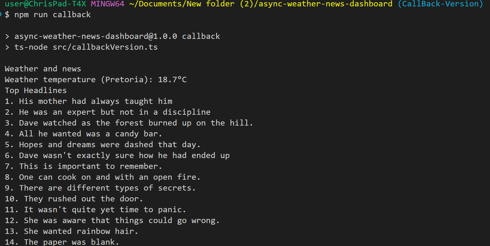
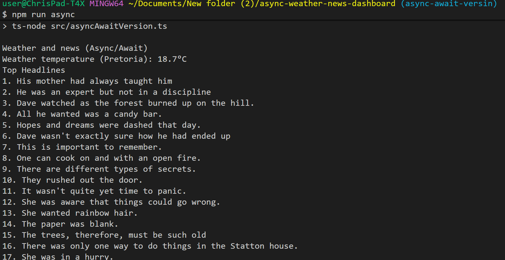
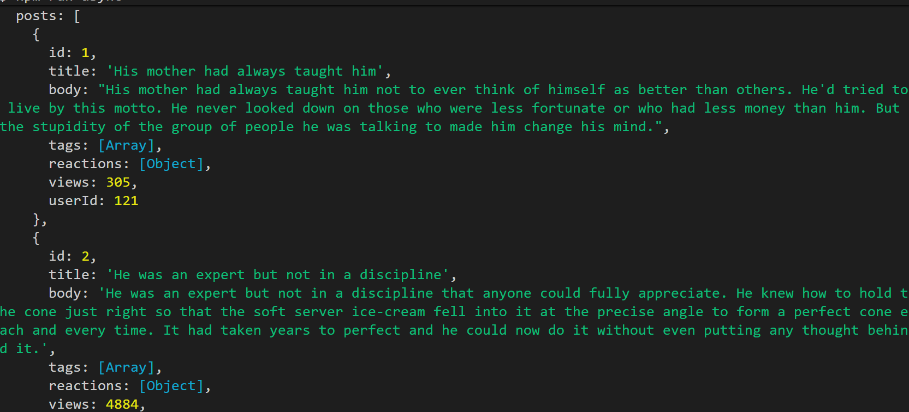
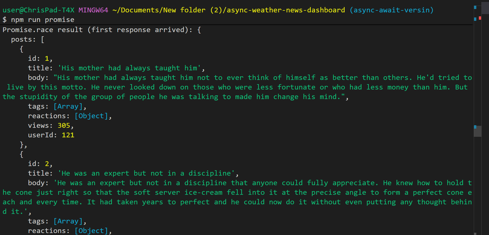
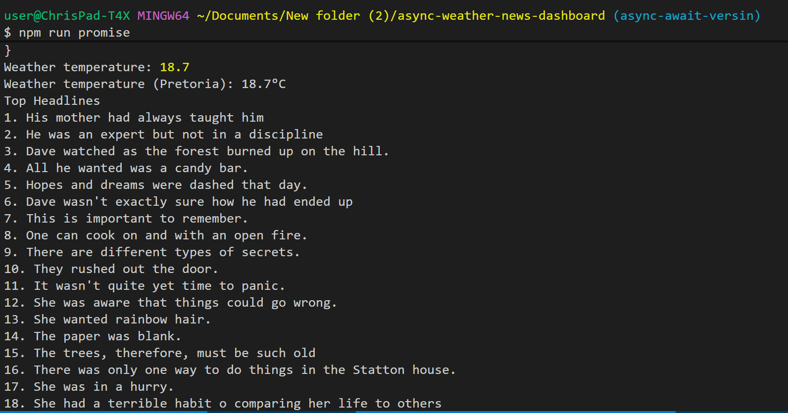

# async-weather-news-dashboard

# ABOUT THE PROJECT
This app fetches weather data and news headlines
from public APIs, showcasing different asynchronous styles, namely:
Callbacks, promises, and async/await. The app uses open meteo api to get weather data and dummyJSON posts api to get news.
Open matio API: https://open-meteo.com/.
dummyJSON posts API: https://dummyjson.com/

# TECHNOLOGIES USED
This app was built using:
TOOLS:
* Node JS 
* VS Code
LANGUAGES:
* Typescript

# INSTALLATION
* Clone repository.
* Navigate to async-weather-news-dashboard(cd async-weather-news-dashboard).
* Install Dependencies(npm install)
* Compile TypeScript(npx tsc)
* Use "npm run async" to run asyncAwaitVersion.
* Use "npm run callback" to run callbackVersion.
* Use "npm run promise" to run promiseVersion.

# STATUS
* Project is complete.

# LEARNING OUTCOMES
* Callbacks  
* Promises  
* Async/Await (with `try...catch`)  
* Promise.all → Run weather + news requests simultaneously  
* Promise.race → Get the fastest response 

# SCREENSHOTS
* callback version output

* async version output

* promise version output

